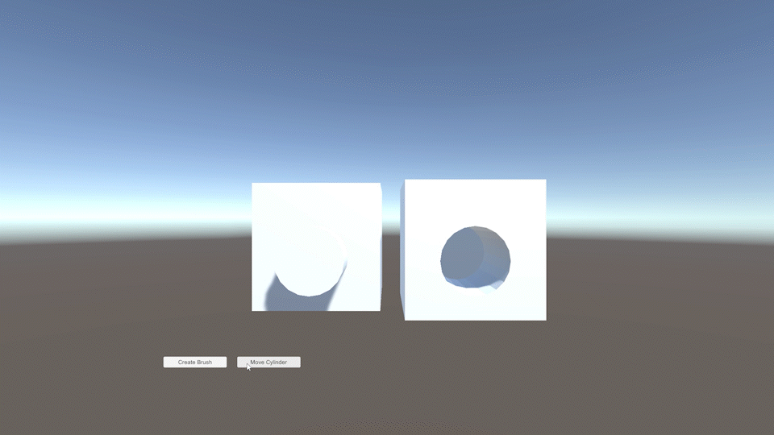
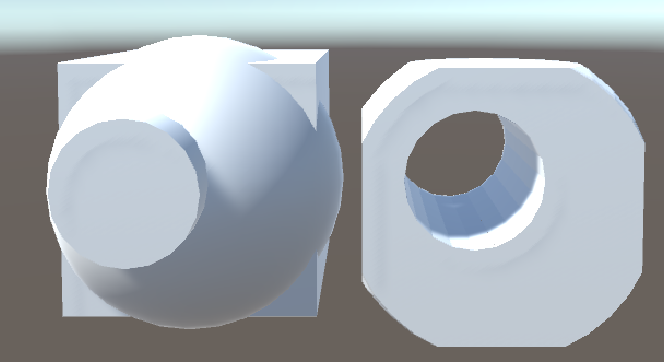

# LibCSG-Runtime

LibCSG-Runtime is a library for performing new mesh from constructive solid geometry (CSG) operations in Unity during the runtime. The available operations are Union, Subtraction, and Intersection.

It is based on the CSG library used in the Godot engine. (https://github.com/godotengine/godot/blob/master/modules/csg/csg.cpp)



## Working

To perform an operation between two objects, a Brush must be created for each object and the mesh must be set up in the Brush. Setting up the mesh in the brush can take time, but once the brush is created and linked to a GameObject, it does not need to be recreated to perform another operation with that Brush. A brush for the result of the operation must also be created.
To perform the operation between the two brushes, the merge_brushes function of a CSGOperation must be used.

## Examples :

- For the GIF above, the code is as follows:


```
using LibCSG;

...

// Create the CSGBrushOperation
CSGOp = new CSGBrushOperation();
// Create the brush to contain the result of the operation
// Give a GameObject allow to have the mesh result link with the GameObject Transform link
// if you don't give a GameObject the Brush create a new GameObject
cube_sub_cylinder = new CSGBrush(GameObject.Find("Result"));

...

// Create the Brush for the cube
cube = new CSGBrush(GameObject.Find("Cube"));
// Set-up the mesh in the Brush
cube.build_from_mesh(GameObject.Find("Cube").GetComponent<MeshFilter>().mesh);

// Create the Brush for the cylinder
cylinder = new CSGBrush(GameObject.Find("Cylinder"));
// Set-up the mesh in the Brush
cylinder.build_from_mesh(GameObject.Find("Cylinder").GetComponent<MeshFilter>().mesh);

...

// Do the operation subtration between the cube and the cylinder 
CSGOp.merge_brushes(Operation.OPERATION_SUBTRACTION, cube, cylinder, ref cube_sub_cylinder);

GameObject.Find("Result").GetComponent<MeshFilter>().mesh.Clear();

// Put the mesh result in the mesh give in parameter if you don't give a mesh he return a new mesh with the result
cube_sub_cylinder.getMesh(GameObject.Find("Result").GetComponent<MeshFilter>().mesh);
```


- For this image:



```
using LibCSG;

...


// Create the CSGBrushOperation
CSGOp = new CSGBrushOperation();
// Create the brush to contain the result of the operation cube_inter_sphere
// You can give a name if you want a specifique name for the GameObject created
cube_inter_sphere = new CSGBrush("cube_inter_sphere");
// Create the brush to contain the result of another operation 
finalres = new CSGBrush(GameObject.Find("Result"));

...

// Create the Brush for the cube
cube = new CSGBrush(GameObject.Find("Cube"));
// Set-up the mesh in the Brush
cube.build_from_mesh(GameObject.Find("Cube").GetComponent<MeshFilter>().mesh);

// Create the Brush for the cube
sphere = new CSGBrush(GameObject.Find("Sphere"));
// Set-up the mesh in the Brush
sphere.build_from_mesh(GameObject.Find("Sphere").GetComponent<MeshFilter>().mesh);

// Create the Brush for the cylinder
cylinder = new CSGBrush(GameObject.Find("Cylinder"));
// Set-up the mesh in the Brush
cylinder.build_from_mesh(GameObject.Find("Cylinder").GetComponent<MeshFilter>().mesh);
    
...

// Do the operation intersection between the cube and the sphere 
CSGOp.merge_brushes(Operation.OPERATION_INTERSECTION, cube, sphere, ref cube_inter_sphere);

// Do the operation subtraction between the previous operation and the cylinder 
CSGOp.merge_brushes(Operation.OPERATION_SUBTRACTION, cube_inter_sphere, cylinder, ref finalres);

GameObject.Find("Result").GetComponent<MeshFilter>().mesh.Clear();

// Put the mesh result in the mesh give in parameter if you don't give a mesh he return a new mesh with the result
finalres.getMesh(GameObject.Find("Result").GetComponent<MeshFilter>().mesh);
```
